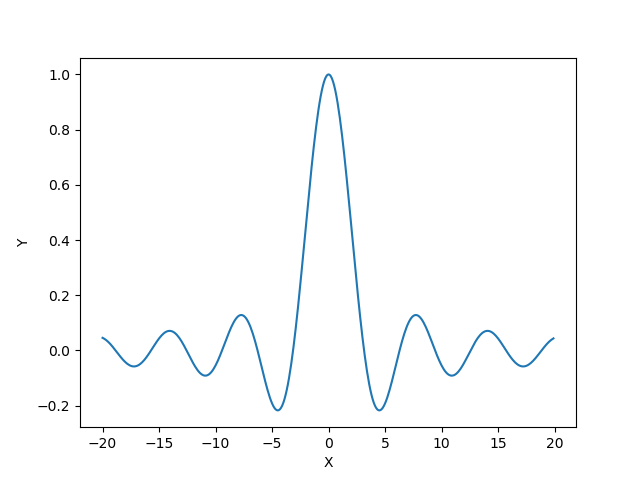

# Programming Assignment 1
## Multiclass Classification

### WU1
#### OAA
##### (A) Train depth 3 decision trees on the WineDataSmall task. What words are most indicative of being Sauvignon-Blanc? Which words are most indicative of not being Sauvignon-Blanc? What about Pinot-Noir (label==2)?

###### Sauvignon-Blanc 

For the WineDataSmall task, the words that are the most indicative of being Sauvignon-Blanc is a certain combination of (*citrus, grapefruit* and *wet*). As we can see from the structure of the decision tree, when *citrus* and *grapefruit* appears in the description but not *wet*, the classifier hit a 100% accuracy in the test dataset by predicting all 14 wines to be Sauvignon-Blanc.

If all of *citurs*, *gooseberry* and *lime* don't appear in the description, the classifier can reach an accuracy of 97.2%, so we conclude that such combination of these three words (*citrus*, *gooseberry* and *lime*) is the most indicative of not being Sauvignon-Blanc. Even though combination of other words could possibly hit higher accuracy, such combination has a significantly larger sample size and is therefore much more convincing.

###### Pinot-Noir 

The combination of (*cherry*, *raspberries* and *integrated*) is the most indicative of being Pinot-Noir. To be more precise, when *integrated* is in the description but neither *cherry* nor *raspberries* is in the description, the classifier hit a 100% accuracy by predicting all 12 wines as Pinot-Noir

If both *cherry*, *cassis* appear in the description but *allspice* does not appear, the classifier can reach a 100% accraucy by predicting all wines as non-Pinot-Noir. Hence we conclude such combination of (*cherry*, *cassis* and *allspice*) is the most indicative for non-Pinot-Noir

##### (B) Train depth 3 decision trees on the full WineData task (with 20 labels). What accuracy do you get? How long does this take (in seconds)? One of my least favorite wines is Viognier -- what words are indicative of this?

I got an accuracy of 37.01% and the training operation takes about 0.4817s on my laptop. The combination of *peaches* and *milk* is the most indicative of Viognier. It reaches a 100% accuracy by predicting all 3 samples correctly. However, this result is not very convincing since the sample size is very small. On the other hand, (*peaches*, *nectarine* and *chilled*) are the most indicative of non-viognier, when none of them appears in the description, 1036 out of 1037 samples are predicted correctly as non-Viognier.

##### (C) Compare the accuracy using zero-one predictions versus using confidence. How much difference does it make?

For the full WineData task, the accuracy using zero-one predictions is 24.68% while using confidence is 36.92%. There is roughly a 12% difference in accuracy and the one using confidence performs better.

For the WineDataSmall task, the accuracy using zero-one predictions is 59.08% while using confidence is 60.39%. There is roughly a 1% difference in accuracy and the one using confidence performs better.

#### AVA

##### (A) Train depth 3 decision trees on the WineDataSmall task. What words are most indicative of being Sauvignon-Blanc? Which words are most indicative of not being Sauvignon-Blanc? What about Pinot-Noir (label==2)?

###### Sauvignon-Blanc 

For the AVA case, we need to go through all the binary classifiers involving Sauvignon-Blanc. There are 4 of such classifiers in total. For different classifiers, the indicative words are also different. 

For Suavignon-Blanc vs. Cabernet-Sauvignon, the indicative words are (no *citrus*, no *lime*, no *melon* ) for predicting Suavignon-Blanc (187/196 correct) and (*citrus*) for predicting Cabernet-Sauvignon (31/31 correct)

For Suavignon-Blanc vs. Pinot-Noir, the indicative words are (no *crisp*, no *lime*, no *lemon*) for predicting Suavignon-Blanc (141/150 correct) and (*crisp*, no *red*) for Pinot-Noir (30/30 correct)

For Suavignon-Blanc vs. Pinot-Gris, the indicative words are (*thai*) for predicting Suavignon-Blanc (5/5 correct) and (no *thai*, no *very*, no *almond*) for Pinot-Noir (56/60 correct)

For Suavignon-Blanc vs. Pinot-Grigio, the indicative words are (*apple*, no *bright*) for predicting Suavignon-Blanc (10/10 correct) and (no *apple*, no *pasta*, no *warm*) for Pinot-Noir (30/30 correct)

###### Pinot-Noir 

For the AVA case, we need to go through all the binary classifiers involving Pinot-Noir. There are 4 of such classifiers in total. For different classifiers, the indicative words are also different. 

For Pinot-Noir vs. Sauvignon-Blanc , the indicative words are (*crisp*, no *red*) for Pinot-Noir (30/30 correct) and (no *crisp*, no *lime*, no *lemon*) for predicting Suavignon-Blanc (141/150 correct) 

For Pinot-Noir vs. Cabernet-Sauvignon , the indicative words are (*cassis*, no *tea*, no *100*) for Pinot-Noir (47/48 correct) and (no *cassis*, *acidity*, no *tannins*) for predicting Cabernet-Sauvignon (22/22 correct) 

For Pinot-Noir vs. Pinot-Gris, the indicative words are (*crisp*, no *red*) for Pinot-Noir (7/7 correct) and (no *crisp*, no *peach*, no *pear*) for predicting Pinot-Gris (142/145 correct)

For Pinot-Noir vs. Pinot-Grigio, the indicative words are (*straw*) for Pinot-Noir (12/12 correct) and (no *straw*, no *crisp*, no *shellfish*) for predicting Pinot-Grigio (142/150 correct)

##### (B) Train depth 3 decision trees on the full WineData task (with 20 labels). What accuracy do you get? How long does this take (in seconds)? One of my least favorite wines is Viognier -- what words are indicative of this?

I got an accuracy of 27.09% and the training operation takes about 0.5510s on my laptop. Some of the most indicative words combination for being Viognier are (no *peaches*, no *peach*, no *pear*) (187/187), (no *peach*, no *peaches*, no *apple*)(144/144). Some of the most indicative words for not being Viognier are *peach*, *peaches*, *fruit*, *freshness*, but the sample size is relatively small.

##### (C) Compare the accuracy using zero-one predictions versus using confidence. How much difference does it make?

For the full WineData task, the accuracy using zero-one predictions is 26.90% while using confidence is 27.00%. By repeating the experiment multiple times, we see that there is nearly no difference in accuracy.

For the WineDataSmall task, the accuracy using zero-one predictions is 52.51% while using confidence is 54.92%. By repeating the experiment multiple times, we see that there is roughly a 2-3% difference in accuracy and the one using confidence performs better.

### WU2
The  test accuracy I get with a balanced tree on the WineData using a DecisionTreeClassifier with max depth 3 is 0.5820568927789934

## Gradient Descent and Linear Classification

### WU3
Usually, the smaller the step size is, the better chance of convergence gradient descent will have. However, if the step size is too small, the convergence will take a very long time to finish.

For this problem, **0.2** is a step size with which the algorithm converges and it converges after about 15 iterations. With 100 iterations, **10** is a step size with which the algorithm diverges, but if we increase iterations, the algorithm will eventually converges because the actual step size in each iteration is inversely proportional to the number of iterations have been done.

### WU4

The non-convex function I come up with is **y =  1/x * sin(x)**

We first we choose **x0 = -1**, and the function manage to converge at the global minimum **x = 4.756**.

Then we choose **x0 = 15**, and the function get caught at local minimium when **x = 17.282**

### WU5

##### test accuracy

SquaredLoss: 0.6863

LogisticLoss: 0.9742

HingeLoss: 0.9852

From the above we can see that HingeLoss works the best for this classification task

##### words with highest weights

By sorting the *w* vector, we can see that the indexes of the top 5 positive are [351, 135, 80, 84, 130] with respective weight of [1.2490, 1.0542, 0.9388, 0.8935, 0.8854]. Then we use the id-to-word mapping and discover that the 5 indexes correspond to ['citrus', 'crisp', 'tropical', 'acidity', 'lime']. Similarly, we could locate the indexes of the top 5 negative, [21, 10, 2, 88, 114], with respective weight of [-1.2929, -0.7731, -0.6759, -0.6074, -0.5870], and they correspond to ['tannins', 'black', 'dark', 'cherry', 'blackberry']

This means that if ['citrus', 'crisp', 'tropical', 'acidity', 'lime'] appear in the decription, then the wine is mostly likely to be class 1 (Cabernet-Sauvignon). However, if ['tannins', 'black', 'dark', 'cherry', 'blackberry'] appear in the description, then the wine is least likely to be class 1 (Cabernet-Sauvignon), but class -1 (Sauvignon-Blanc) instead.